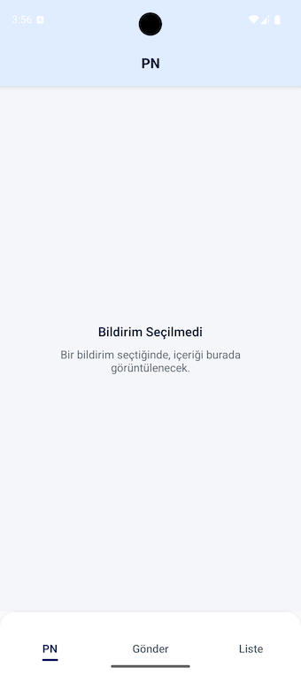
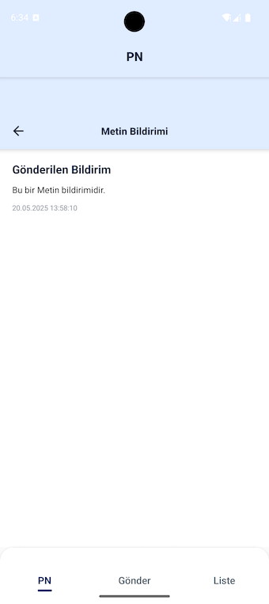
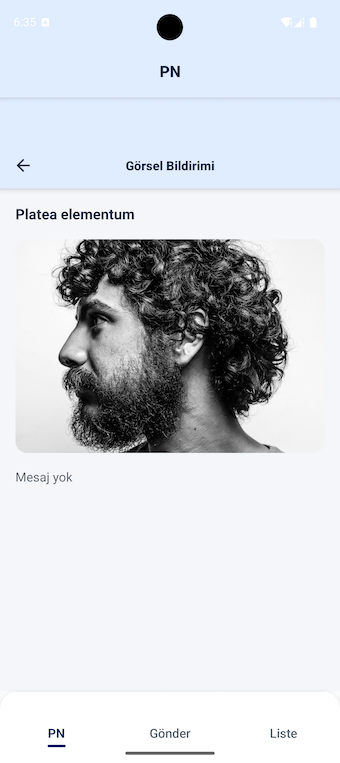
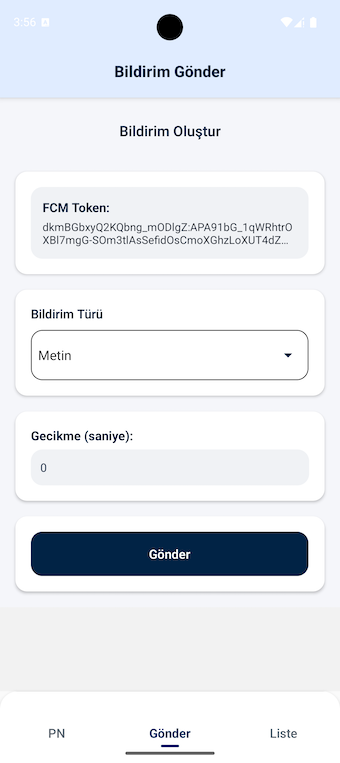
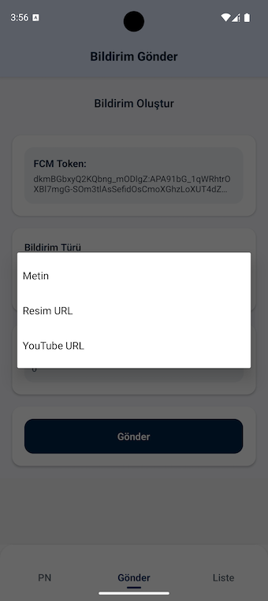
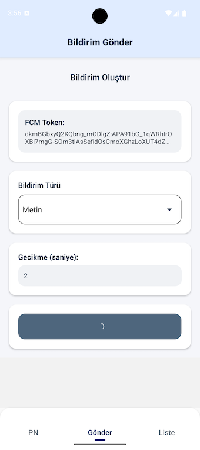
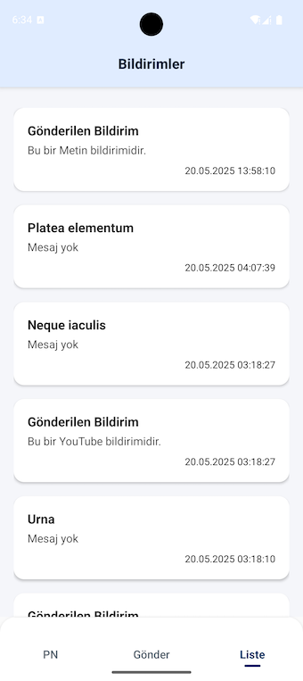

# 📲 CASK RN Challenge - Bildirim Modülü

Bu proje, React Native (v0.79) ile geliştirilen bir push notification (FCM) modülünü içermektedir. Kullanıcıya **Metin**, **Görsel** veya **YouTube bağlantılı** bildirimlerin gönderilip görüntülenmesini sağlar.

---

## 🚀 Özellikler

- Firebase Cloud Messaging (FCM) ile push bildirim desteği
- Bildirim türü seçimi (Metin, Görsel URL, YouTube URL)
- Cihaza özel FCM Token ile hedefli gönderim
- Gecikmeli bildirim gönderimi (X saniye sonra tetikleme)
- Bildirim listesi ve detay görüntüleme
- Modern ve sade kullanıcı arayüzü (NativeWind)

---

## 🛠️ Kullanılan Teknolojiler

| Teknoloji           | Açıklama                                      |
|---------------------|-----------------------------------------------|
| React Native (v0.79)| Mobil uygulama iskeleti                       |
| TypeScript          | Güvenli ve sürdürülebilir kod                 |
| Firebase Cloud Messaging | Bildirim servisi                        |
| Zustand             | State management (token, liste vb.)          |
| React Navigation v6 | Sekmeli yapı ve ekran yönlendirme            |
| NativeWind          | Tailwind benzeri stil altyapısı              |
| AsyncStorage        | Lokal veri saklama (token, geçmiş)           |

---

## 📷 Ekranlar ve Akış

### 1️⃣ Ana Sekme: `PN`

#### Varsayılan Durum (Seçim Yapılmadı)
Kullanıcı henüz bir bildirim seçmemişse sade bir yönlendirme ekranı görünür.



#### Bildirim Seçildikten Sonra
Bildirim türüne göre özel detay ekranı açılır:

---

### 2️⃣ Metin Bildirimi Detayı

- **Başlık:** `Gönderilen Bildirim`
- **Mesaj:** `Bu bir Metin bildirimidir.`
- **Tarih:** Gönderim zamanı gösterilir



---

### 3️⃣ Görsel Bildirimi Detayı

- **Başlık:** `Platea elementum`
- **Görsel:** URL'den çekilen fotoğraf
- **Mesaj:** (varsa) gösterilir



---

### 4️⃣ YouTube Bildirimi Detayı

> (Görsel burada yoksa aynı yapı içinde `WebView` veya `Thumbnail + Aç` şeklinde uygulanır.)

---

### 5️⃣ Bildirim Gönderme Ekranı

Kullanıcı, test amaçlı manuel olarak bildirim gönderebilir.

#### 🧩 Bileşenler:
- **FCM Token:** Otomatik alınır ve kopyalanabilir
- **Bildirim Türü:** Dropdown (Metin, Görsel URL, YouTube URL)
- **Gecikme:** İsteğe bağlı saniye cinsinden gönderim gecikmesi





---

### 6️⃣ Bildirim Listesi Ekranı

Kullanıcının aldığı tüm bildirimler burada listelenir.

#### İçerik:
- Başlık ve kısa açıklama
- Bildirim gönderim zamanı
- Tıklanınca `PN` sekmesindeki detay ekranına yönlendirir



---

## ⚙️ Kurulum

```bash
git clone https://github.com/Aylinbaykan/cask.git
cd cask
npm install
cd ios && pod install && cd ..
npx react-native run-android

---

## 🔒 Gizli Dosyalar (Sensitive Files) Hakkında

Bu projede Firebase entegrasyonu için aşağıdaki iki özel yapılandırma dosyasına ihtiyaç duyulur:

- `android/app/google-services.json`
- `ios/GoogleService-Info.plist`

Bu dosyalar Firebase'e ait gizli anahtarları ve proje kimliğini içerdiğinden, **güvenlik gerekçesiyle `.gitignore` dosyasına eklenmiş ve GitHub'a dahil edilmemiştir.**

### 📌 Neden `.gitignore` kullanıldı?

- Bu dosyaların herkese açık bir repoya eklenmesi, Firebase projesinin yetkisiz kişiler tarafından kullanılmasına neden olabilir.
- GitHub, bu gibi sızmaları tespit edip uyarı verir (Secret scanning).
- Proje güvenliğini korumak için bu dosyalar sadece geliştirici makinelerinde bulunmalı, repoya eklenmemelidir.

### 🛠️ Uygulamayı çalıştırmak için yapılması gerekenler:

Firebase entegrasyonunun çalışabilmesi için bu dosyaların manuel olarak eklenmesi gerekir:

1. Firebase Console’a giriş yap
2. Kendi Android ve iOS uygulamanı oluştur
3. Aşağıdaki dosyaları indir:
   - `google-services.json` → `android/app/` dizinine
   - `GoogleService-Info.plist` → `ios/` dizinine
4. Uygulamayı yeniden başlat

> Bu sayede hem proje güvenliği sağlanır hem de uygulama Firebase servislerine başarılı şekilde bağlanabilir.
